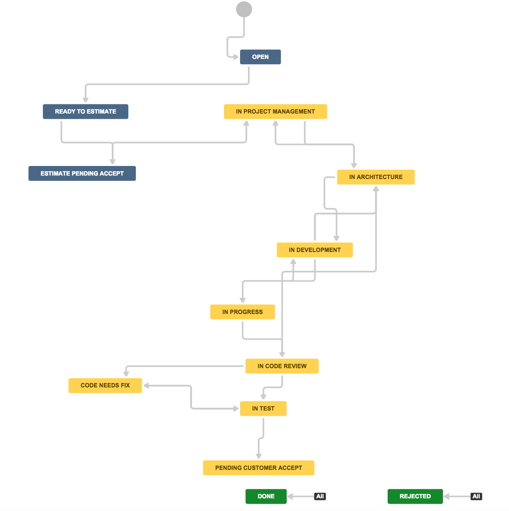

Task lifecycle
=======

A tasks lifecycle is clearly defined inside Jira, and looks like the following:

**The steps explained**

**Open:**

When a new task is created, either by the customer or us, it is in the "open" state. This is just a placeholder, and nothing happens at this status.

**Ready to estimate:**

When a task should be started, it's moved into the "ready to estimate" status. This means there is enough information on the task to give a rough estimate.

Often a lot of questions will be asked back an forth. The project manager should at this stage get all details clear, and make sure to have thought of as many details as possible at this stage. 

**Estimate pending accept:**

When a project manager has been able to make an estimate, it's put in this status. This is a status where the customer should accept or decline the estimate on the task.

**In project management:**

Here the project manager should follow the project management template, and spec the task *in details*. Everything has to be extremely clear, so all non-technical questions are answered in the specification (how should things look? how do they behave?).

A project manager always makes a test matrix, that describes exactly how a task can be tested.

**In architecture:**

Here the architect should follow the architecture template so the task so it technically is extremely clear. As this point it should be clear what files, methods and workflows that should be changed to work on it. Often subtasks are created to avoid bigger than 5 hour tasks.

**In development:**

At this stage there are small tasks of maximum 5 hours of development. A developer will move one task at a time into next stage.

**In progress:**

In progress is when a developer is working on a single task. A developer will implement the change in a new feature, and fill out the template when done.

**In code review:**

As the code is always placed inside a pull request, a code reviewer can easily review the code and give feedback on the code inside the source code management system (ie. Github or BitBucket).

**In test:**

Here a tester will test the implementation. The tester will both follow the test matrix the project manager made, in addition to testing if the implementation is nice and makes sense.

**Code needs fix:**

If the code review OR test found a challenge with the task, it's placed in this status. This means the developer hsa to fix something in the task. A task can end here if:

- A code reviewer found a technical change
- A tester found a functional change
- A customer found some problem

**Pending customer accept:**

After we are sure the task is ready for customer accept, we put the task in this stage. It's essential we have tested the task ourselves at this stage and is sure everything is ready.

**Done:**

When a task has been marked as done by the customer, a task can be seen as done and closed.

If something new opens in regards to a task, a new task has to be created.

Rejected:
Any task can be cancelled at any time. This can be done by either customer or ourself, if a task should be ignored.
